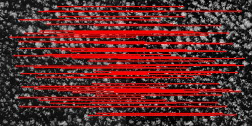

# Keypoint Detection and Matching for Sentinel-2 Satellite Images



This project involves an algorithm for keypoint detection and matching applied to pairs of satellite images from the Sentinel-2 dataset. The primary goal is to identify and visualize corresponding keypoints between two images, aiding tasks such as image alignment and comparison.

## Algorithm Code

The algorithm is implemented in Python, and it was tested using the 3.9 version.

The algorithm is best described by its core function:

**`detect_and_match_keypoints(image1, image2, target_size=None, min_distance=50, save_to=None)`**
   - Detects keypoints in two images and matches them.
   - Parameters:
     - `image1`: First image.
     - `image2`: Second image.
     - `target_size`: Resize images to the given size if not None.
     - `min_distance`: Parameter for the Harris corner detector; larger values result in fewer keypoints.
     - `save_to`: Path to save the image of matches; if None, the image is not saved.
   - Returns: Numpy array representing the matches.

   The algorithm first resizes the images (if specified), converts them to grayscale, detects keypoints using the Harris corner detector, and then matches the keypoints using the BRIEF descriptor.

## Key Concepts of the Algorithm

1. **Harris Corner Detector:**
   - Used to identify corner points in the image, which are potential keypoints.
   - Adjusted by the `min_distance` parameter to control the density of keypoints.

2. **BRIEF Descriptor:**
   - Binary descriptor capturing local image information around keypoints.
   - Extracted using random pixel pairs and their intensity comparisons.
   - Efficient for matching due to its binary nature.

3. **Matching Process:**
   - Matches keypoints based on their BRIEF descriptors.
   - Visualization of matches using matplotlib, with the option to save the resulting image.

## Inference Code

The provided inference code demonstrates how to use the algorithm on the command line. The `--image1` and `--image2` arguments specify the paths to the two images, and the optional `--save-to` argument specifies the path to save the image of matched keypoints.

### Running the Inference Code:

```bash
python inference.py --image1 path/to/image1.jpg --image2 path/to/image2.jpg --save-to path/to/save/matches_image.png
```
- `--image1`: Path to the first image (required).
- `--image2`: Path to the second image (required).
- `--save-to`: Path to save the image of matched keypoints (optional).
